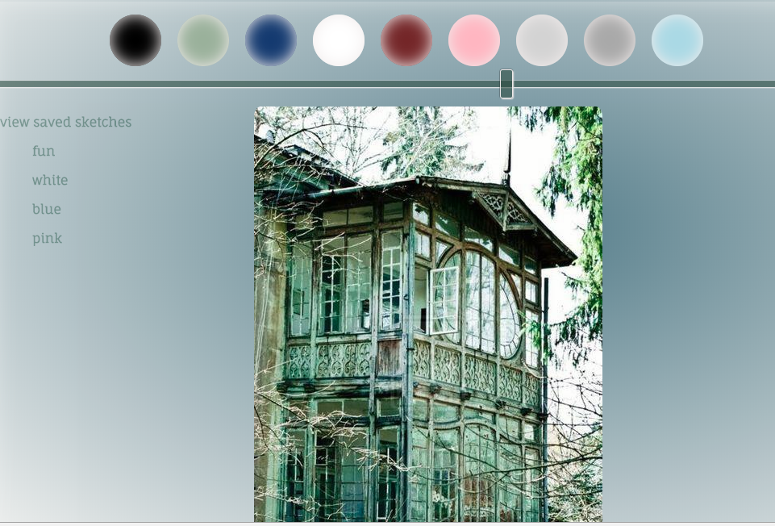
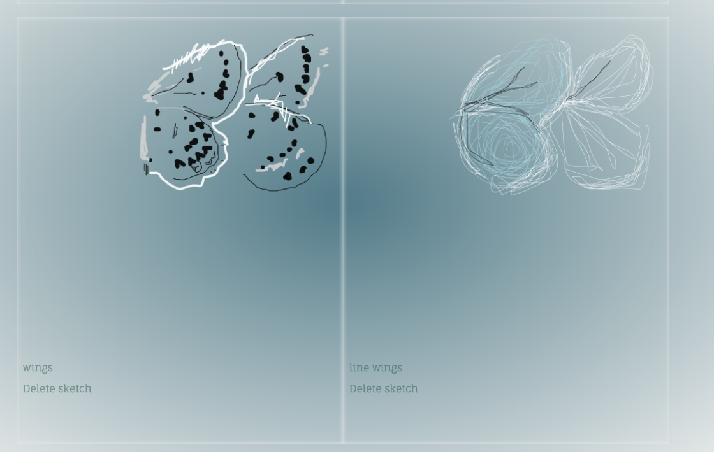
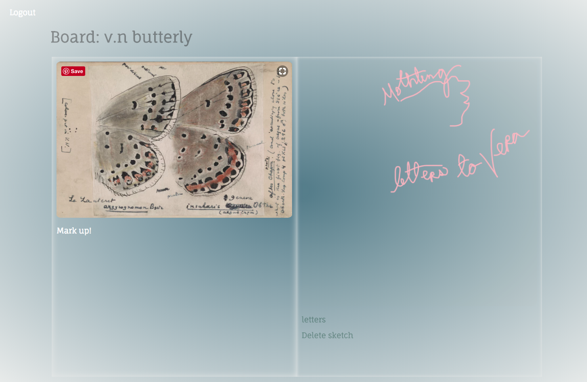

# Sketchbook


# Project Title

Sketchbook is a digital interface for users to create, store, and view freeform sketches made with HTML5 canvas over images uploaded from the internet.  This project was created in AngularJS as a NSS capstone exercise.

## Getting Started



### Prerequisites

in order to run this program you will need these dependencies and dev dependencies from npm with the commands 

```
npm install 
grunt
```

## Deployment

in order to use with firebase you will need an additional fb-creds folder with a firebase api key 
for the purposes of this project and to demonstrate concept acquisition I have kept my keys private

## Built With

* [angular-canvas-painter](https://www.npmjs.com/package/angular-canvas-painter) 
## Contributing

Please read [CONTRIBUTING.md](https://gist.github.com/PurpleBooth/b24679402957c63ec426) for details on our code of conduct, and the process for submitting pull requests to us.


## Authors

* **Courtney Brothers** - [courtneybrothers](https://github.com/courtneybrothers)

## License

This project is licensed under the MIT License - see the [LICENSE.md](LICENSE.md) file for details


